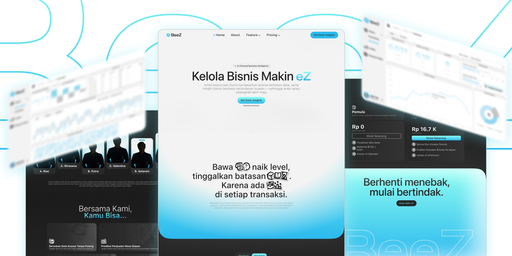
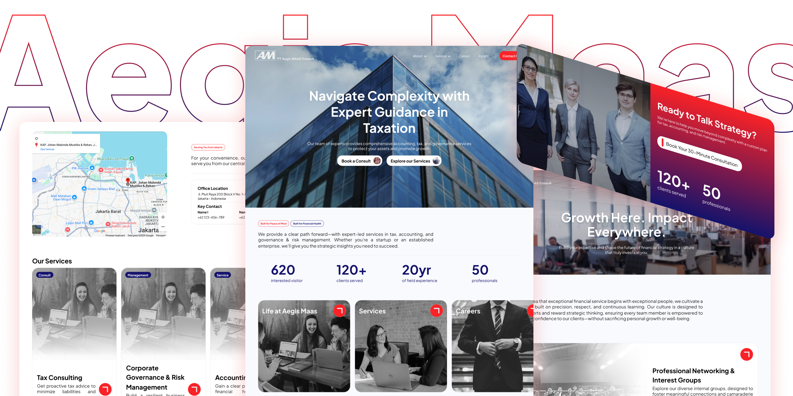

# Hi, I'm Ananda Wirasena 👋

Frontend developer and graphic designer based in Bali, Indonesia, currently transitioning into Machine Learning and Generative AI Engineering. I like understanding *why* a model or an interface behaves the way it does — not just shipping something that works.

I'm looking for people to build with, ML/GenAI learning opportunities, and my first real step into applied machine learning.

  <picture>
    <source media="(prefers-color-scheme: dark)" srcset="./assets/Terminal-Dark.svg" />
    <source media="(prefers-color-scheme: light)" srcset="./assets/Terminal-Light.svg" />
    
  </picture>

## About Me

Design is where I started — Figma, interfaces, the discipline of making things clear. It's still my safety net, the thing I'm reliably good at. But the pull toward machine learning and generative AI is what actually keeps me up at night: the logic of it, the "why does this work" instead of "how do I make this work."

I care less about memorizing a framework's opinions and more about understanding the reasoning underneath a system — whether that system is a UI, a model, or a data pipeline.

## Currently Building

### TPS E-Kanban — Industrial Engineering, Universitas Udayana

An electronic kanban system built around Toyota Production System (TPS) principles for the Industrial Engineering department at Universitas Udayana. On the production floor, ESP-connected buttons trigger kanban signals that hit an API — built in collaboration with a hardware engineer handling the device side — and the resulting state is reflected in real time across tablet interfaces distributed around the floor.

I designed the system architecture: frontend, backend, and database each containerized with Docker and hosted on a single server, with the whole thing served over an isolated local network so the tablets and ESP devices can reach it without any exposure to the open internet.

**Status:** In progress · isolated network deployment

<!-- no screenshot yet — swap this placeholder once i have one -->
<!-- 

  

 -->

`Docker` · `System Architecture` · `Isolated Network` · `REST API` · `IoT / ESP` · `Next.js` · `React`

## Past Work

### BeeZ — Biz Made EZ

BeeZ is an LLM-powered data analysis platform built for retailers who have sales data but no easy way to make sense of it. A retailer uploads a raw CSV, and a modular pipeline takes over from there — reasoning through each column to decide what to keep, what to drop, and how to fill in the gaps — before feeding the cleaned data into models that produce sales forecasts and product segmentation.

I designed and built the UI end-to-end. This was a capstone project built with a team, which is also why the repository below doesn't live under my own account.

**Status:** Built and previously deployed for a bootcamp capstone · currently offline

[BeeZ — Repository](https://github.com/EgiKelo9/pijak-capstone)

<!-- swap in your landing page screenshot / gif once ready -->

  

`Next.js` · `React` · `Python` · `LLM Pipeline` · `Forecasting` · `Segmentation`

### Client Landing Page (Freelance)

A paid landing page project for a private client. Designed the full interface in Figma first, then implemented it with a modern React stack. Not linking the repo or live site out of respect for the client's confidentiality.

  

`Next.js` · `React` · `Tailwind CSS` · `shadcn/ui` · **Completed, unreleased**

## Technologies

<b>Machine Learning &amp; AI</b>

 

| Tool | What I use it for |
| :-- | :-- |
| Python | the language everything else runs on |
| scikit-learn | classical ML — pipelines, model evaluation |
| PyTorch | learning the fundamentals |
| LangGraph | stateful agents, conversational flows |
| Hugging Face | models, tokenizers, datasets |

<b>Frontend &amp; Design</b>

 

| Tool | What I use it for |
| :-- | :-- |
| Next.js / React | component architecture, routing, state |
| TypeScript | typed, less error-prone JavaScript |
| Tailwind CSS | utility-first styling |
| shadcn/ui | accessible, composable components |
| Figma | design before code, always |

<b>Tools</b>

 

| Tool | What I use it for |
| :-- | :-- |
| Git | version control, obviously |
| VS Code | home base |
| Jupyter | exploration and experiments |
| Linux (Arch/CachyOS, Hyprland) | daily driver |

## Currently Learning

Working through machine learning fundamentals for my thesis, building a modular AI + classical ML assistant on the side, and reading one ML paper a week — no rush, just consistency. Also exploring how to combine LLM flexibility with the structure of classical ML pipelines.

## GitHub Activity

  
  

  

## Let's Connect

If you're working on something interesting in ML/GenAI, have a learning opportunity, or just want to talk shop about design meeting machine learning — I'd be glad to hear from you.

  
  
  

<!--
  ┌─ CHECKLIST ──────────────────────────────────────────────────────┐
  │                                                                  │
  │  BANNER                                                          │
  │  [ ] export your ASCII-terminal design as two SVGs:              │
  │      ./assets/banner-dark.svg  and  ./assets/banner-light.svg    │
  │      (create the /assets folder in this repo, then commit both)  │
  │                                                                  │
  │  SCREENSHOTS                                                     │
  │  [ ] add TPS E-Kanban screenshot/gif → assets/projects/          │
  │      tps-ekanban.png (no image yet — this is the priority one)   │
  │  [ ] add BeeZ landing page image/gif → assets/projects/          │
  │      beez-landing.png (swap to .gif once recordly works on       │
  │      your Linux setup)                                           │
  │  [ ] add client landing page screenshot → assets/projects/       │
  │      client-landing.png                                          │
  │                                                                  │
  │  CONTENT TO DOUBLE-CHECK                                         │
  │  [ ] confirm TPS E-Kanban's exact tech (I inferred Next.js/      │
  │      React for the tablet frontend and a generic REST API —      │
  │      swap in your actual backend framework and the ESP's         │
  │      firmware language if you want it listed)                    │
  │  [ ] confirm BeeZ's exact tech stack (I inferred Python for      │
  │      the pipeline — swap in your team's actual backend stack     │
  │      if it's not plain Python, e.g. FastAPI, Flask, etc.)        │
  │  [ ] "Currently Learning" — update as your focus shifts,         │
  │      this section ages fastest                                  │
  │                                                                  │
  │  SEO NOTES (why some things are written the way they are)        │
  │  [ ] the H1 uses your real name + no emoji-only styling —        │
  │      GitHub/Google index README text, plain names help search   │
  │  [ ] every image has a descriptive alt attribute — keep this     │
  │      pattern for any image you add later                        │
  │  [ ] keywords like "Machine Learning", "Generative AI",          │
  │      "Frontend Developer" appear naturally in the first          │
  │      paragraph — this is the part most likely to get indexed    │
  │  [ ] your GitHub bio (Settings → Profile, not this file) should  │
  │      also include 2-3 of these same keywords for consistency     │
  │                                                                  │
  └──────────────────────────────────────────────────────────────────┘
-->